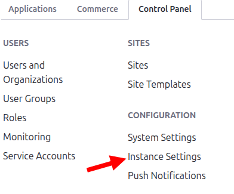
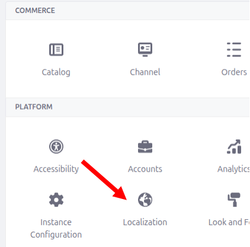
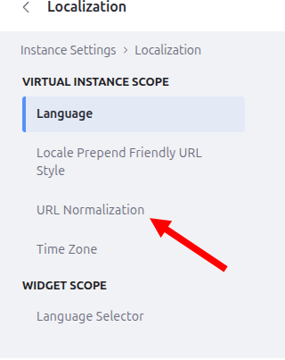
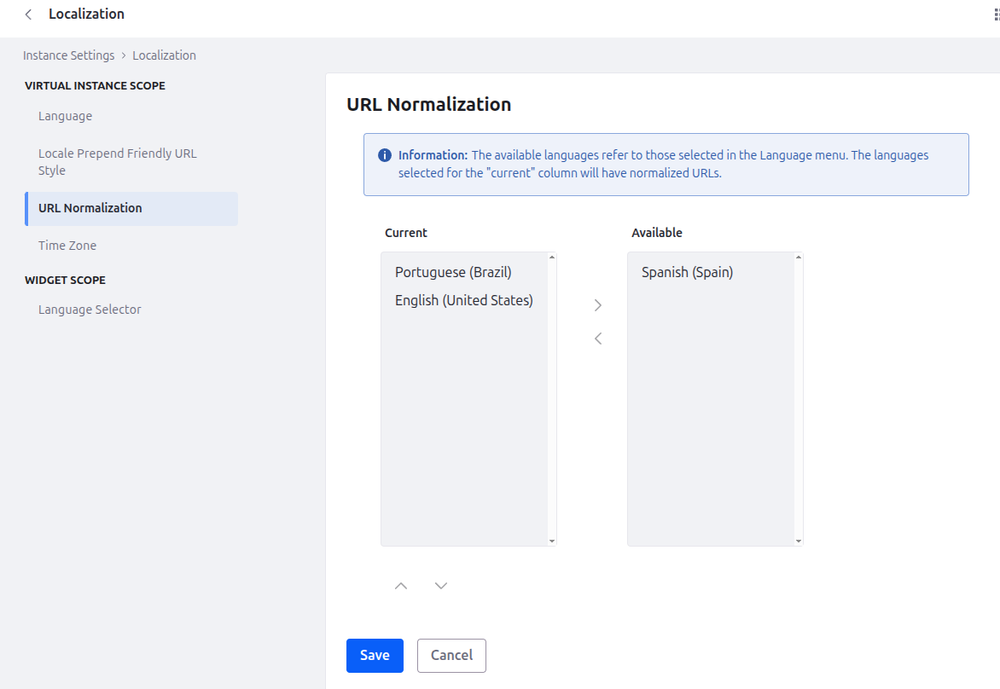

# Liferay Friendly URL Accent Stripper

If you just want to use or test the module, download the JAR below and drop it into the deploy folder.

## [Download JAR here](br.com.venturecode.stripfriendlyurlaccents-1.0.0.jar)

**OR**

After installing the module, follow these steps to configure the accent stripping behavior.

---

### Step 1
Go to the **Control Panel**.

    
 

### Step 2
In the Control Panel, click on **Instance Settings**.

### Step 3
Navigate to **Localization → URL Normalization**.

### Step 4
On the URL Normalization configuration screen, select the languages you want to normalize and click **Save**.

### Step 5
Finally, create a new page and configure its Friendly URL as usual.

---

### Tip

If you need to apply the same behavior to **Web Content URLs**, create a new class that extends `JournalArticleLocalServiceWrapper`, following the same approach used in the `CustomLayoutFriendlyURLLocalServiceWrapper` class.

---

### Compatibility

**Tested only on Liferay 7.4**
